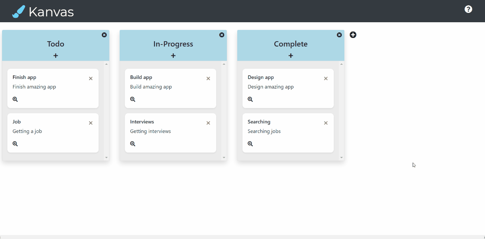

# Kanvas
A kanban board application with drag and drop, context menu and all editing features

## Live Demo
https://kanvas.jsonkim.com

## Features
1. When the application starts, it has 3 empty columns: "Todo", "In progress", "Done"
2. Each column has a "+" button and users can click this button to create a task card in any column
3. Users can change the order of columns using drag-and-drop
4. Users can create columns
5. Users can edit column titles
6. Users can delete columns
7. Users can create tasks
8. Users can move tasks between columns using drag-and-drop
9. Users can can delete a task.
10. Users can edit task titles and descriptions
11. Users can add images as attachments to cards and the app can save images to LocalStorage
12. Users can move tasks between columns using the "Move" button in the context menu
13. Each card has a context menu you can access through right-click (desktop)
14. Each card has a context menu you can access through long-press (mobile)
15. All data is saved to LocalStorage and loaded from it when the app is executed or reloaded

## Technologies Used
* React.js
* Bootstrap
* HTML5
* CSS3
* AWS EC2

## Getting Started
### `1. cd kanvas `
###
* Clone the repository and navigate to the directory
### `2. npm install `
###
* Install all dependencies
### `3. npm run start `
###
* Compile project
4. Access application by entering [https://localhost:3000](https://localhost:3000) in the browser.

## Lessons Learned
* Utilizing React Beautiful Drag and Drop(DnD)
* Utilizing React Context Menu
* Building code blocks for saving images to LocalStorage
* Creating an application in a group-environment in a given short period of time (3days)

## Preview

